# MERN E-Commerce Platform

A full-stack e-commerce application with advanced features, built with MongoDB, Express, React, Node.js, and Tailwind CSS v4.

## User Pages
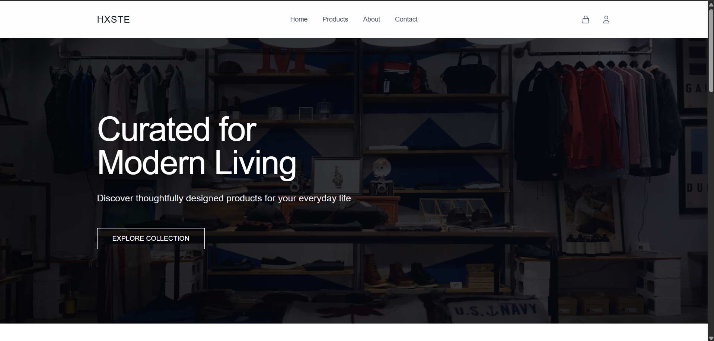
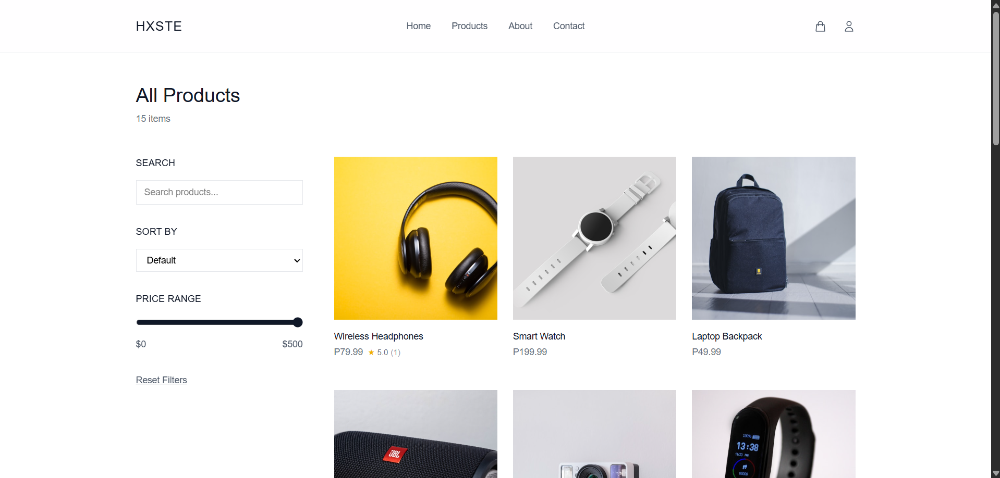
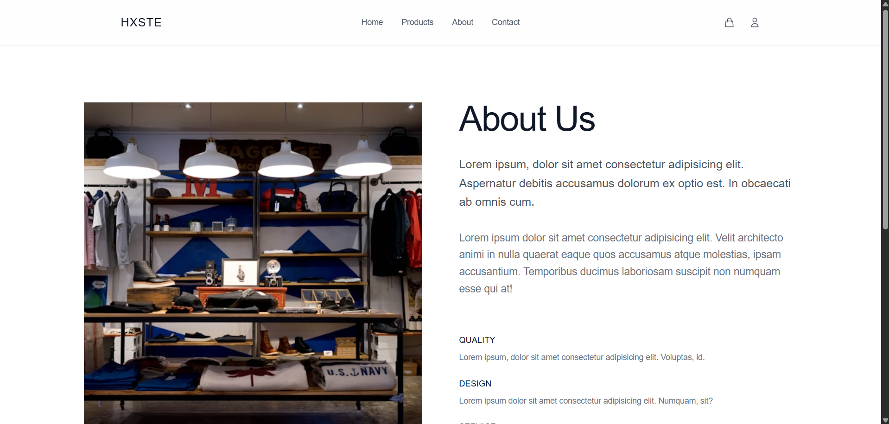
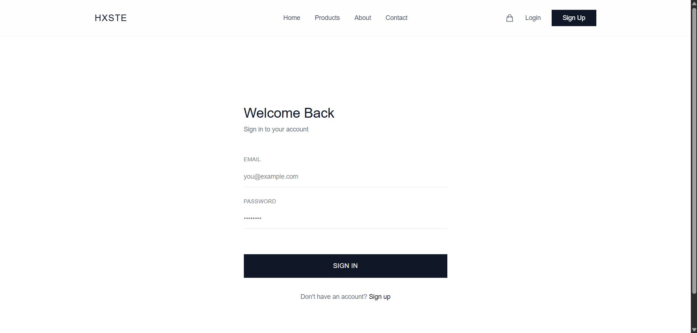
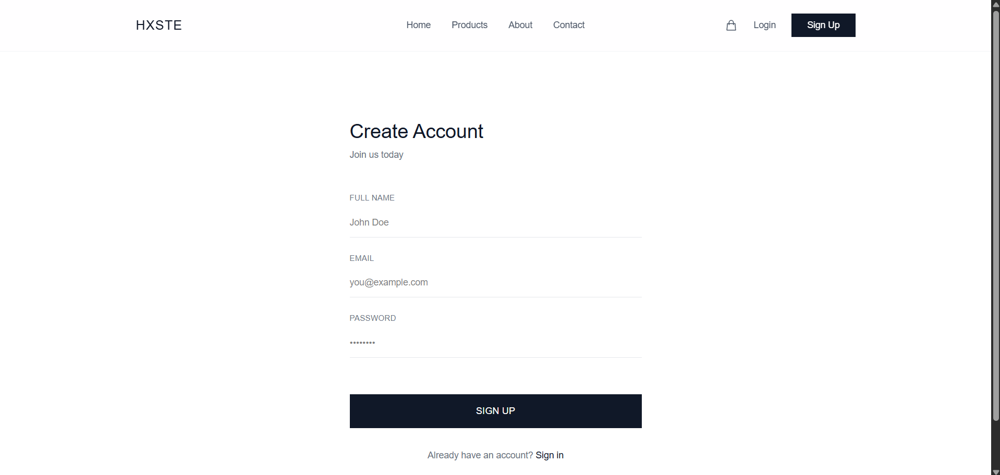

## Admin Pages
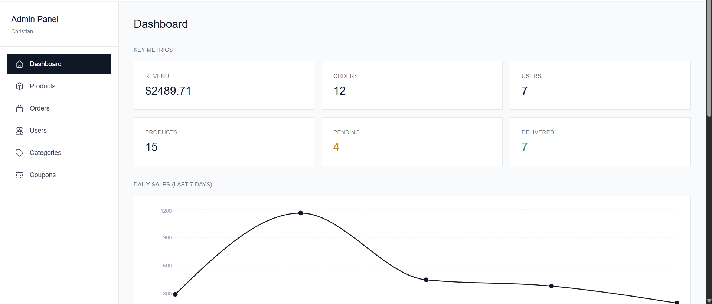
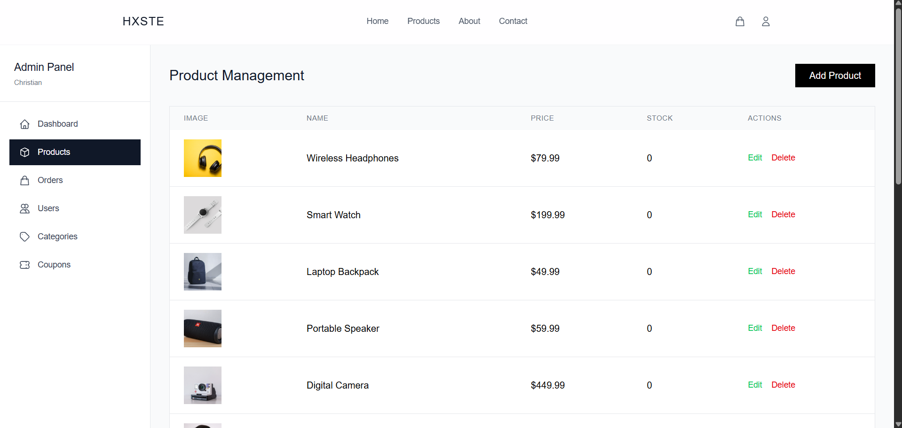
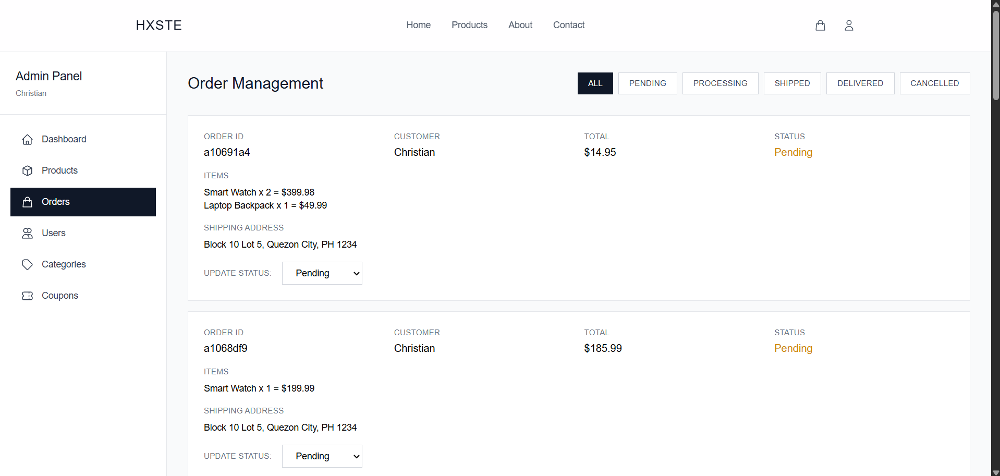
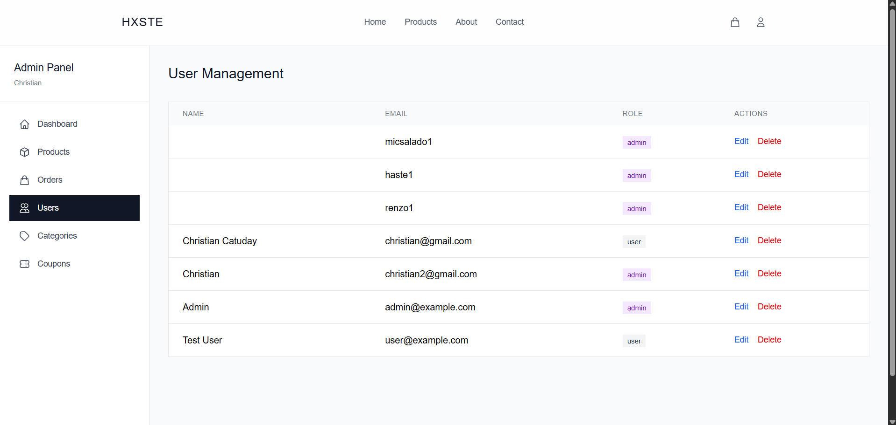
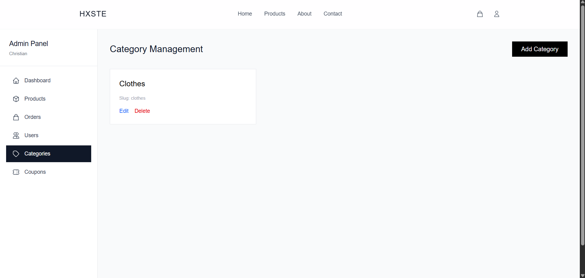
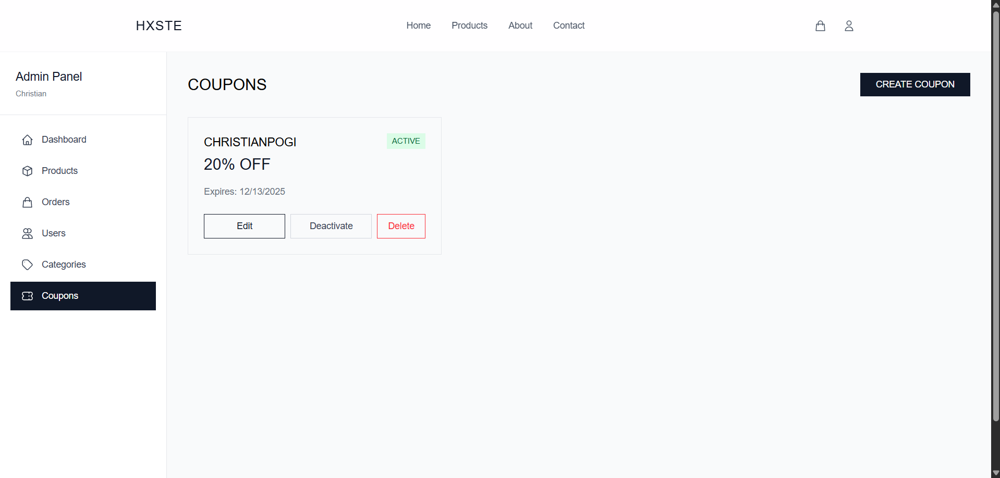

## Features

### User Features
- Modern, minimalist UI with Tailwind CSS v4
- Product browsing with search and filtering
- Smart shopping cart with quantity controls and persistence
- User authentication (register/login with JWT)
- Checkout process with address management
- Product reviews and ratings system
- Order tracking and history
- Product search functionality
- Fully responsive design (mobile, tablet, desktop)
- Cart merge on login (preserves cart from logged-out session)

### Admin Features
- Comprehensive admin dashboard with analytics
- Daily sales chart (last 7 days)
- Top selling products table
- Order management with status filtering
- User management (view, edit, delete users)
- Product management (CRUD operations)
- Category management
- Coupon system with percentage discounts and expiration dates
- Review moderation (admin can delete abusive reviews)
- Real-time metrics (revenue, orders, users, products)
- Order status filters (all, pending, processing, shipped, delivered, cancelled)

## Tech Stack

### Frontend
- React 19
- React Router DOM v7
- Tailwind CSS v4
- Axios (HTTP client)
- Vite (build tool)
- Recharts (analytics charts)
- react-hot-toast (notifications)

### Backend
- Node.js
- Express v5
- MongoDB with Mongoose
- JWT Authentication (HTTP-only cookies)
- bcryptjs (password hashing)

## Getting Started

### Prerequisites
- Node.js (v18 or higher)
- MongoDB (local or Atlas)

## API Endpoints

### Authentication
- `POST /api/auth/register` - Register a new user
- `POST /api/auth/login` - Login user
- `POST /api/auth/logout` - Logout user
- `GET /api/auth/me` - Get current user (protected)

### Products
- `GET /api/products` - Get all products
- `GET /api/products?search=query` - Search products
- `GET /api/products/:id` - Get single product
- `POST /api/products/:id/reviews` - Add product review (protected)
- `DELETE /api/products/:productId/reviews/:reviewId` - Delete review (admin)

### Orders
- `POST /api/orders` - Create new order (protected)
- `GET /api/orders/user` - Get user's orders (protected)
- `GET /api/orders/:id` - Get single order (protected)
- `PATCH /api/orders/:id/status` - Update order status (admin)

### Coupons
- `GET /api/coupons` - Get all coupons (admin)
- `POST /api/coupons` - Create coupon (admin)
- `PATCH /api/coupons/:id` - Update coupon (admin)
- `DELETE /api/coupons/:id` - Delete coupon (admin)
- `POST /api/coupons/validate` - Validate coupon code

### Categories
- `GET /api/categories` - Get all categories
- `POST /api/categories` - Create category (admin)
- `PATCH /api/categories/:id` - Update category (admin)
- `DELETE /api/categories/:id` - Delete category (admin)

### Admin
- `GET /api/admin/analytics` - Get dashboard analytics (admin)
  - Daily sales (last 7 days)
  - Top selling products
  - Revenue, orders, users, products counts
  - Order status distribution
- `GET /api/admin/orders?status=pending` - Get orders with status filter (admin)
- `GET /api/admin/users` - Get all users (admin)
- `POST /api/admin/products` - Create product (admin)
- `PATCH /api/admin/products/:id` - Update product (admin)
- `DELETE /api/admin/products/:id` - Delete product (admin)
- `DELETE /api/admin/users/:id` - Delete user (admin)

## Key Features Explained

### Product Reviews & Ratings
- Users can leave reviews with 1-5 star ratings
- Each user can review a product only once
- Reviews show timestamp and user information
- Average rating calculated automatically
- Admin can delete abusive reviews
- Reviews sorted by latest first

### Coupon System
- Admin creates coupons with percentage discounts (1-100%)
- Coupons have expiration dates
- Can activate/deactivate coupons
- Real-time validation at checkout
- Prevents expired or inactive coupons

### Admin Analytics Dashboard
- **Daily Sales Chart**: Line chart showing sales and order count for last 7 days
- **Top Products**: Table of top 5 best-selling products by units sold
- **Order Status Distribution**: Pie chart showing order statuses
- **Revenue Overview**: Bar chart with monthly revenue
- **Real-time Metrics**: Total revenue, orders, users, and products

### Order Management
- Status filtering: All, Pending, Processing, Shipped, Delivered, Cancelled
- Color-coded status badges
- Update order status with dropdown
- View detailed order information
- Track order history

### Context API
- **AuthContext**: User authentication state with JWT tokens
- **CartContext**: Shopping cart with localStorage persistence and merge on login

### Security Features
- JWT tokens stored in HTTP-only cookies (XSS protection)
- Password hashing with bcryptjs
- Protected routes (authentication required)
- Admin-only routes (role-based access control)
- Input validation and sanitization

## Future Enhancements

- [ ] Payment integration (Stripe/PayPal)
- [ ] Wishlist functionality
- [ ] Email notifications (order confirmation, shipping updates)
- [ ] Advanced product filters (price range, category, rating)
- [ ] Product image upload and management
- [ ] Stock management and low-stock alerts
- [ ] Customer support chat
- [ ] Multiple shipping addresses
- [ ] Gift cards
- [ ] Product recommendations
- [ ] Dark mode theme toggle

## License

MIT

## 👤 Author

Christian Catuday
